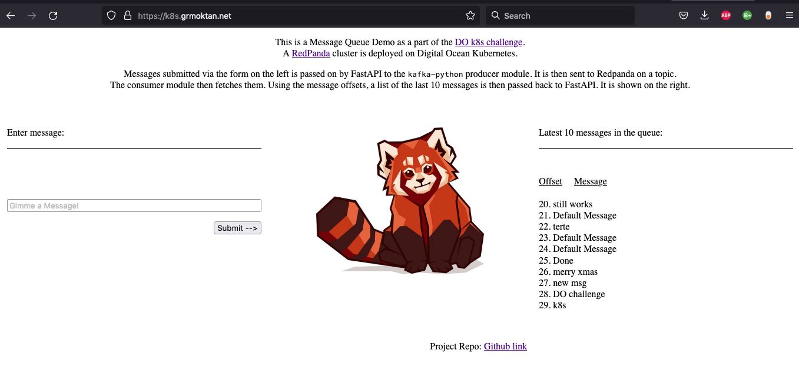
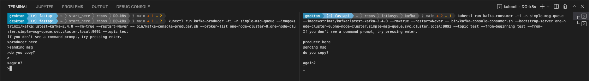

# Digital Ocean Kubernetes Challenge

[DO K8s Challenge](https://www.digitalocean.com/community/pages/kubernetes-challenge) : Deploy a scalable message queue

Deployed a [redpanda](https://github.com/vectorizedio/redpanda) cluster on DOKS. 

A FastAPI webapp to demo message flow using ``kafka-python`` producer and consumer. 

Dockerized the webapp, pushed to DO container registry and fetched by corresponding deployment.





----

## Setting up DO CLI:

Create token from the DO control panel -> API.

````
brew install doctl
doctl auth init --context <NAME> # prompts for token
doct auth list
doctl auth switch --context <NAME>
````

## Setting up k8s on DO:

Following the steps in [Kubernetes Starter kit](https://github.com/digitalocean/Kubernetes-Starter-Kit-Developers/)


````
doctl k8s cluster create k8s-challenge \
      --auto-upgrade=false \
      --maintenance-window "saturday=21:00" \
      --node-pool "name=basicnp;size=s-4vcpu-8gb-amd;count=3;tag=cluster2;label=type=basic;auto-scale=true;min-nodes=2;max-nodes=4" \
      --region fra1

# verify
doctl k c list

# add to ~/.kube/config
doctl k c kubeconfig save <ID>
````

**Ingress Controller using Ambassador Edge Stack**

````
helm repo add datawire https://www.getambassador.io

wget https://raw.githubusercontent.com/digitalocean/Kubernetes-Starter-Kit-Developers/main/03-setup-ingress-controller/assets/manifests/ambassador-values-v6.7.13.yaml -O manifests/ambassador-values-v6.7.13.yaml

helm install ambassador datawire/ambassador \
      --version 6.7.13 \
      --namespace ambassador \
      --create-namespace \
      -f "manifests/ambassador-values-v6.7.13.yaml"

# check
helm ls -n ambassador

# Fetch the ingress load-balancer ip 
doctl compute load-balancer list --format IP,ID,Name,Status

````

Use this IP address to create dns record for the sub/domain and create a host.

````
kubectl apply -f manifests/ambassador-host.yaml
````

## Deploying Redpanda :

Redpanda provides an operator that takes care of cluster lifecycle. cert-manager is a pre-requisite.

**Install cert-manager**

cert-manager is required by the cluster. 

````
helm repo add jetstack https://charts.jetstack.io 
helm repo update 
helm install \
  cert-manager jetstack/cert-manager \
  --namespace cert-manager \
  --create-namespace \
  --version v1.2.0 \
  --set installCRDs=true
````

**Install Redpanda Operator**
````
helm repo add redpanda https://charts.vectorized.io/ 
helm repo update

# crd
kubectl apply -k https://github.com/vectorizedio/redpanda/src/go/k8s/config/crd?ref=v21.11.2

# operator
helm install \
    redpanda-operator \
    redpanda/redpanda-operator \
    --namespace redpanda-system \
    --create-namespace \
    --version v21.11.2
````

**Deploy Redpanda cluster**

We go with a single node cluster here.

````
wget https://raw.githubusercontent.com/vectorizedio/redpanda/dev/src/go/k8s/config/samples/one_node_cluster.yaml -O manifests/one_node_cluster.yaml

kubectl create ns simple-msg-queue

kubectl apply \
    -n simple-msg-queue \
    -f manifests/one_node_cluster.yaml

````

**Work with msg queue**


````
# cluster status
kubectl -n simple-msg-queue run -ti --rm \
      --restart=Never \
      --image docker.vectorized.io/vectorized/redpanda:v21.11.2 \
      -- rpk --brokers one-node-cluster-0.one-node-cluster.simple-msg-queue.svc.cluster.local:9092 \
      cluster info

# create topic
kubectl -n simple-msg-queue run -ti --rm \
      --restart=Never \
      --image docker.vectorized.io/vectorized/redpanda:v21.11.2 \
      -- rpk --brokers one-node-cluster-0.one-node-cluster.simple-msg-queue.svc.cluster.local:9092 \
      topic create test-msg 

# list topics
kubectl -n simple-msg-queue run -ti --rm \
      --restart=Never \
      --image docker.vectorized.io/vectorized/redpanda:v21.11.2 \
      -- rpk --brokers one-node-cluster-0.one-node-cluster.simple-msg-queue.svc.cluster.local:9092 \
      topic list

````

## Deploying Producer and Consumer using kafka api

Run on two terminals.

````
# run a producer
kubectl run kafka-producer -ti -n simple-msg-queue --image=strimzi/kafka:latest-kafka-2.4.0 --rm=true --restart=Never -- bin/kafka-console-producer.sh --broker-list one-node-cluster-0.one-node-cluster.simple-msg-queue.svc.cluster.local:9092 --topic test

# run a consumer
kubectl run kafka-consumer -ti -n simple-msg-queue --image=strimzi/kafka:latest-kafka-2.4.0 --rm=true --restart=Never -- bin/kafka-console-consumer.sh --bootstrap-server one-node-cluster-0.one-node-cluster.simple-msg-queue.svc.cluster.local:9092 --topic test --from-beginning
````

Screenshot:




## Simple demo web page


We build a FastAPI web app that passes form input to ``kafka-python`` producer. It then sends the message to the broker on a topic. A consumer then receives the message and passes the last 10 offset messages to FastAPI and is displayed on the webpage. The webapp is dockerized and pusehd to DO container registry.

**Setting up DO Container Registry**

````
doctl registry create do-registry-1 --subscription-tier basic

doctl registry kubernetes-manifest | kubectl apply -f -

kubectl get secrets registry-do-registry-1

kubectl patch serviceaccount default -p '{"imagePullSecrets": [{"name": "registry-do-registry-1"}]}'
````

**Building Docker Image & pushing to DO container registry**

````
doctl registry login

cd docker
docker build -t msg-queue-demo .
docker tag msg-queue-demo registry.digitalocean.com/do-registry-1/msg-queue-demo
docker push registry.digitalocean.com/do-registry-1/msg-queue-demo

cd ..
````

**Demo web app deployment**

````
# deployment 
kubectl apply -n simple-msg-queue -f manifests/msg-queue-demo.yaml
    
# map the service to the AES host
kubectl apply -f manifests/mapping.yaml
````

Demo link: [https://k8s.grmoktan.net](https://k8s.grmoktan.net)


